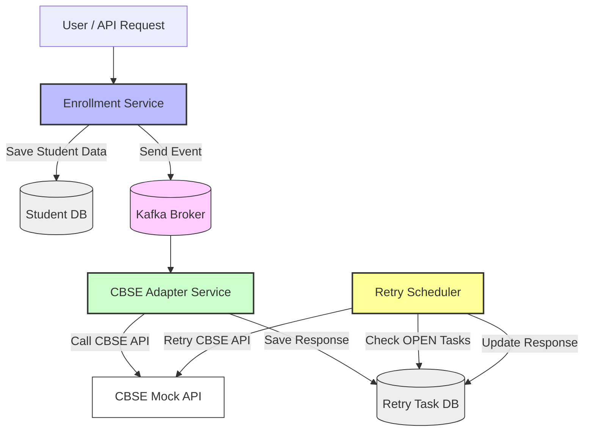

# 🏫 Student Onboarding System
<!--ABOUT THE PROJECT-->
## About the project
This project is a reactive backend system that collects student data, stores it securely in MongoDB, and publishes onboarding events to Kafka. It also features a retry mechanism to handle failed onboarding attempts using a configurable scheduler.

## 📌 Features

- Accepts and persists student data in MongoDB
- Publishes onboarding events to Kafka
- Handles failures with retry mechanism
- Configurable retry logic for different task types
- Reactive and non-blocking using Spring WebFlux

---

## 🧩 Modules Overview

### 📁 Model

- `Student`: Represents a student entity stored in MongoDB.
- `RetryEvent`: Represents an onboarding task that needs to be retried.
- `RetryConfig`: Configuration for retry intervals per task type.

### 📁 DTO

- `StudentOnboardingEvent`: Data object sent to Kafka for onboarding.

### 📁 Repository

- `StudentRepository`: Reactive CRUD operations for Student.
- `RetryEventRepository`: Manages retry events and filtering.
- `RetryConfigRepository`: Fetches retry configuration per task type.

### 📁 Service

- `StudentService`: Core logic to create students and publish onboarding events.
- Contains conversion logic between `Student` and `StudentOnboardingEvent`.

---

## 🛠️ Workflow Overview

1. **Student Onboarding Event**
    - The onboarding process begins when a new student enrollment request is received.

2. **Request to CBSE API**
    - The system sends the onboarding request to the external CBSE API.

3. **Response Handling**
    - The response from the CBSE API is evaluated to determine the next steps.

   #### ✅ On Success
    - Retry status is marked as `CLOSED`.
    - No further action is taken.

   #### ❌ On Server Error (e.g., 500)
    - Retry logic is triggered.
    - Retry status remains `OPEN`.

   #### ⚠️ On "Student Already Enrolled"
    - Retry status is marked as `FAILED`.
    - The response metadata, including the error message, is stored in the `responseMetadata` field for reference.

4. **Retry Mechanism**
    - A scheduled retry process checks for all retry events with `OPEN` status.
    - Retries are attempted based on the values of:
        - `retryAfterInMins`: Time interval before next retry.
        - `maxRetryCount`: Maximum number of retry attempts allowed.

---

## ⚙️ Tech Stack

- 🧩 **Spring Boot (WebFlux)** – Reactive, non-blocking REST API
- 🍃 **MongoDB (Reactive)** – For storing student and retry data
- 📨 **Apache Kafka** – For onboarding event messaging
- ⚛️ **Project Reactor (Mono/Flux)** – Reactive programming
- 🧑‍💻 **Kotlin** – Main programming language

### 🧪 Event Simulation

This section demonstrates how different Aadhaar numbers simulate varied CBSE API responses to test the retry logic and status handling.

| 🔢 Request No. | 🧑 Name                              | 📝 Purpose                                                                                   |
|----------------|--------------------------------------|----------------------------------------------------------------------------------------------|
| 1              | **Student Onboarding - OK**          | Sends an event with Aadhaar ending in `0` → Simulates success → Returns **HTTP 200** → Retry status: `CLOSED` |
| 2              | **Student Onboarding - Conflict**    | Sends an event with Aadhaar ending in `1` → Simulates **"Student Already Enrolled"** → Returns **HTTP 409** → Retry status: `FAILED` |
| 3              | **Student Onboarding - Error**       | Sends an event with Aadhaar ending in `2` → Simulates **Server Error** → Returns **HTTP 500** → Retry status: `OPEN` |

> 💡 These simulations help validate business logic, error handling, and retry mechanisms under controlled conditions.

## 📁 API Endpoints

| Method | Endpoint             | Description                 |
|--------|----------------------|-----------------------------|
| POST   | /students            | Create and onboard student |

---

## 🔄 Retry Mechanism

- Retry tasks are stored as instances of the RetryEvent entity.
- Each task's retry behavior (like max retry count and interval) is governed by the RetryConfig entity.
- A scheduler (configured separately) periodically checks for RetryEvents with status OPEN and retries them based on:
    - nextRunTime
    - retryAfterInMins
    - maxRetryCount
